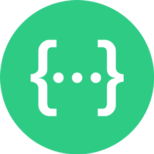

# Обо мне:
QA Engineer with a solid foundation in both manual and automated testing. I completed a comprehensive QA course covering manual testing, test automation, and core QA processes, followed by hands-on commercial experience testing a real-world product for 2 months. Currently looking for new opportunities in QA — open to full-time roles and collaborations.

## 📄 Моё резюме:
[Здесь будет ссылка на резюме](https://ссылочку_сюда)

## Портфолио
- Тестовая документация
  -  [Чек-листы](https://ссылочку_сюда)
  -  [Тест-кейсы](https://ссылочку_сюда)
  -  [Баг-репорты](https://ссылочку_сюда)
- Коллекция в Postman
  -  [Название проекта](https://ссылочку_сюда)
- SQL запросы
  -  [Название проектв](https://ссылочку_сюда)

## 💻 Инструменты и технологии:

          

## 🌐 Мои контакты:

## 📊 GitHub Stats:
 
 

